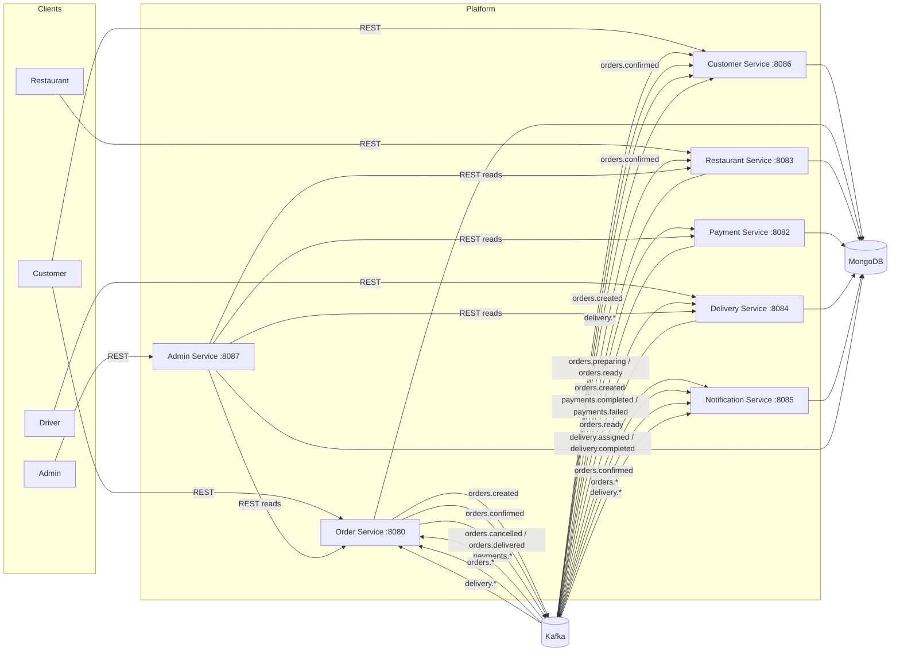

# Food Delivery Platform — Distributed Microservices

A distributed food delivery platform built as seven independent Ballerina
microservices that coordinate over Apache Kafka and persist to MongoDB.
No service reads another service's database; cross-service coordination is
event-driven, and Admin is the single read-only consumer of the others'
public APIs.

## Architecture



## Order lifecycle

`CREATED → CONFIRMED → PREPARING → READY → OUT_FOR_DELIVERY → DELIVERED`,
with `CANCELLED` reachable before pickup.

| Step | Triggered by | Transition |
|---|---|---|
| `CREATED` | customer `POST /orders` | Order Service writes the order, emits `orders.created` |
| `CONFIRMED` | Payment Service consumed `orders.created` and captured | Payment Service emits `payments.completed`; Order Service moves the order on |
| `PREPARING` | restaurant `POST /kitchen/{id}/orders/{orderId}/prepare` | Restaurant Service emits `orders.preparing` |
| `READY` | restaurant `POST .../ready` | Restaurant Service emits `orders.ready` |
| `OUT_FOR_DELIVERY` | Delivery Service found a free driver | Delivery Service emits `delivery.assigned` |
| `DELIVERED` | driver `POST /deliveries/{orderId}/complete` | Delivery Service emits `delivery.completed`; Order Service emits `orders.delivered` |
| `CANCELLED` | declined payment, or `PUT /orders/{id}/cancel` | Order Service emits `orders.cancelled` |

Order Service is the only owner of order status. Every other service
publishes a fact about *its own* domain and Order Service decides what that
means for the lifecycle, so the state machine cannot be bypassed.

## Topics

| Topic | Produced by | Consumed by |
|---|---|---|
| `orders.created` | Order | Payment, Customer, Notification |
| `payments.completed` | Payment | Order |
| `payments.failed` | Payment | Order |
| `orders.confirmed` | Order | Restaurant, Customer, Notification |
| `orders.preparing` | Restaurant | Order, Customer, Notification |
| `orders.ready` | Restaurant | Order, Delivery, Customer, Notification |
| `delivery.assigned` | Delivery | Order, Customer, Notification |
| `delivery.completed` | Delivery | Order, Customer, Notification |
| `orders.cancelled` | Order | Customer, Notification |
| `orders.delivered` | Order | Customer, Notification |

Every topic is created by the `kafka-init` one-shot container with 3
partitions. All events are published with the `orderId` as the record key,
so every event for one order is hashed to the same partition and consumed
in order, while different orders are processed in parallel. Each service
uses its own consumer group, so all services receive each event.

## Services

| Service | Port | Database | Responsibility |
|---|---|---|---|
| Customer | 8086 | `customer_db` | Accounts, delivery address book, order history |
| Order | 8080 | `order_db` | The order state machine |
| Restaurant | 8083 | `restaurant_db` | Menus, stock, opening hours, kitchen queue |
| Payment | 8082 | `payment_db` | Simulated capture, `payments.*` events |
| Delivery | 8084 | `delivery_db` | Drivers, dispatch, delivery lifecycle |
| Notification | 8085 | `notification_db` | Multi-channel alerts per actor |
| Admin | 8087 | `admin_db` | Reports on orders, restaurants, delivery, payments |

Each service owns exactly one database and one collection set. Event
consumers are idempotent (Payment, Restaurant, Delivery and Customer all
guard on "have I already processed this order?"), so a redelivered Kafka
record cannot double-charge a customer or decrement stock twice.

### Customer Service

```
POST   /customers
GET    /customers
GET    /customers/{id}
PUT    /customers/{id}
DELETE /customers/{id}
GET    /customers/{id}/summary            order counts, lifetime spend, default address
GET    /customers/{id}/addresses
POST   /customers/{id}/addresses
PUT    /customers/{id}/addresses/{addressId}
DELETE /customers/{id}/addresses/{addressId}
GET    /customers/{id}/orders?status=     historical order data
```

Order history is a projection built from Kafka, not a read of the Order
Service database, so a customer can still see their history while Order
Service is restarting or being rescaled.

### Admin Service

```
GET /admin/reports/orders        volume, revenue, average order value, cancellation rate, orders by hour
GET /admin/reports/restaurants   per-restaurant orders, revenue, stock on hand, open now
GET /admin/reports/deliveries    dispatch times, delivery times, driver utilisation
GET /admin/reports/payments      success rate, captured value
GET /admin/reports?type=         previously generated reports
GET /admin/reports/{reportId}    a stored report
```

Each call generates a report, stores it in `admin_db`, and returns it with
its `reportId`.

## Running with Docker

```bash
cd food-delivery-platform
docker compose up --build
```

Compose starts Kafka, creates all ten topics, starts MongoDB, then brings up
the seven services. First run pulls images and compiles each service, so
allow a few minutes. kafka-ui is on <http://localhost:8081> for watching
messages flow.

| Service URL |
|---|
| Order <http://localhost:8080> |
| Payment <http://localhost:8082> |
| Restaurant <http://localhost:8083> |
| Delivery <http://localhost:8084> |
| Notification <http://localhost:8085> |
| Customer <http://localhost:8086> |
| Admin <http://localhost:8087> |
| MongoDB <mongodb://localhost:27017> |

Stop with `docker compose down`; add `-v` to also drop the database volume.

### End-to-end walkthrough

```bash
# 1. A customer signs up and saves where the food goes.
CUST=$(curl -s -X POST localhost:8086/customers -H 'Content-Type: application/json' \
  -d '{"name":"Asha","email":"asha@example.com","phone":"0812345678"}' | jq -r .customerId)
curl -s -X POST localhost:8086/customers/$CUST/addresses -H 'Content-Type: application/json' \
  -d '{"label":"Home","street":"12 Sam Nujoma Drive","city":"Windhoek","postalCode":"10001"}'

# 2. A restaurant registers with a menu.
REST=$(curl -s -X POST localhost:8083/restaurants -H 'Content-Type: application/json' \
  -d '{"name":"Kaukau","location":"Windhoek","openingTime":"08:00","closingTime":"21:00",
       "menu":[{"itemId":"M1","name":"Beetroot stew","price":45.50,"stock":20}]}' | jq -r .restaurantId)

# 3. The order is placed; Payment, Customer and Notification all react.
ORDER=$(curl -s -X POST localhost:8080/orders -H 'Content-Type: application/json' \
  -d "{\"customerId\":\"$CUST\",\"restaurantId\":\"$REST\",
       \"items\":[{\"itemId\":\"M1\",\"name\":\"Beetroot stew\",\"price\":45.50,\"quantity\":2}]}" | jq -r .orderId)
curl -s localhost:8080/orders/$ORDER          # CONFIRMED, or CANCELLED on a declined payment

# 4. The kitchen works the order; stock is decremented on confirmation.
curl -s -X POST localhost:8083/kitchen/$REST/orders/$ORDER/prepare
curl -s -X POST localhost:8083/kitchen/$REST/orders/$ORDER/ready

# 5. A driver is dispatched, then completes the drop-off.
DRIVER=$(curl -s -X POST localhost:8084/drivers -H 'Content-Type: application/json' \
  -d '{"name":"Kabelo"}' | jq -r .driverId)
curl -s localhost:8084/deliveries/$ORDER     # ASSIGNED to $DRIVER
curl -s -X POST localhost:8084/deliveries/$ORDER/complete

# 6. Everyone's view of the finished order, and the platform reports.
curl -s localhost:8080/orders/$ORDER                    # DELIVERED
curl -s localhost:8086/customers/$CUST/orders           # history, projected from Kafka
curl -s localhost:8085/notifications?userId=$CUST
curl -s localhost:8087/admin/reports/orders
curl -s localhost:8087/admin/reports/deliveries
```

Payment fails 20% of the time (`PAYMENT_FAILURE_RATE`), so re-run step 3 if
the order comes back `CANCELLED` — that is the decline path working.

## Running locally without Docker

Start MongoDB and Kafka, then run each service in its own terminal. Every
setting is a `configurable`, so both an environment variable and a `--ballerina-config` file work.

```bash
cd order-service && bal run            # then restaurant, payment, delivery,
                                       # notification, customer, admin
```

```bash
MONGODB_CONNECTION_URL=mongodb://localhost:27017 \
KAFKA_BOOTSTRAP_URL=localhost:9092 \
ORDER_SERVICE_URL=http://localhost:8080 \
PAYMENT_SERVICE_URL=http://localhost:8082 \
RESTAURANT_SERVICE_URL=http://localhost:8083 \
DELIVERY_SERVICE_URL=http://localhost:8084 \
bal run
```

Topics are auto-created by a local broker; for the same explicit 3-partition
setup as Compose, create them with `kafka-topics.sh --create --topic
orders.created --partitions 3` and repeat for the table above.

## Design notes

- **Bounded contexts.** Each service has its own database and its own
  consumer groups. A service is deployed, scaled or restarted without
  touching the others.
- **One writer per fact.** Only Order Service writes order status. Payment
  Service reports what happened to a payment; Restaurant Service reports
  what happened in the kitchen; Delivery Service reports what happened to a
  delivery. This keeps the state machine in one place.
- **Partition key = `orderId`.** Preserves per-order ordering while allowing
  cross-order parallelism.
- **Idempotent consumers.** Every consumer checks whether it has already
  handled an order before acting, so at-least-once delivery is safe.
- **Read-only reporting.** Admin Service uses the peers' REST APIs instead of
  their databases, so no reporting tool can mutate or leak service data.
